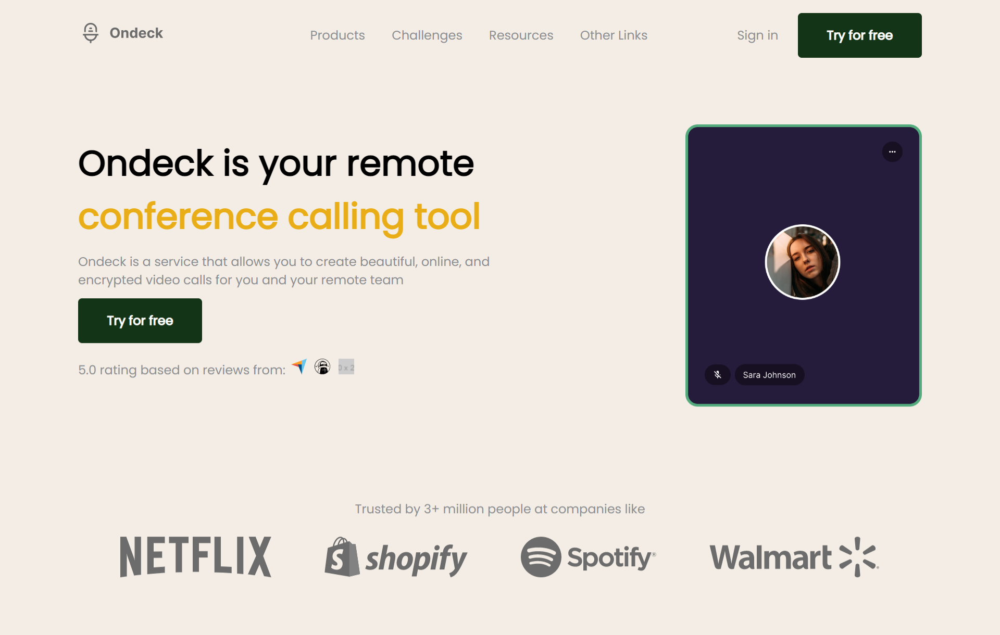

# Codewell - JavaScript 30 Navbar

This is a solution to the [JavaScript 30 Navbar challenge on Codewell](https://www.codewell.cc/challenges/javascript30-navbar--623f19001fa95910c7bf998e). Codewell's aim is to provide you with real-world design templates that you can use to practice your HTML and CSS projects.

## Table of contents

- [Overview](#overview)
  - [The challenge](#the-challenge)
    - [Welcome to Codewell](#welcome-to-codewell)
    - [I've completed the challenge, now what?](#ive-completed-the-challenge-now-what)
    - [Submit your solution to Codewell](#submit-your-solution-to-codewell)
    - [Join our community on Slack](#join-our-community-on-slack)
    - [Wes Bos's Javascript30](#wes-boss-javascript30)
    - [Fonts Used](#fonts-used)
  - [Screenshot](#screenshot)
  - [Links](#links)
- [My process](#my-process)
  - [Built with](#built-with)
  - [What I learned](#what-i-learned)
  - [Continued development](#continued-development)
- [Author](#author)
- [Credits](#credits)

## Overview

### The challenge

#### Welcome to Codewell

Codewell's aim is to provide you with real-world design templates that you can use to practice your HTML and CSS projects.

Free or paid, all templates are high quality and will make great portfolio pieces.

#### I've completed the challenge, now what?

We recommend using one of these two websites to deploy your projects

- [GitHub Pages](https://pages.github.com/)
- [Netlify](https://www.netlify.com/)

They're super easy to setup and you should have your website up and running in no time, just follow their instructions.

##### Submit your solution to Codewell

Visit the relevant challenge on [Codewell](https://codewell.cc) and click on 'Submit Solution' right under the challenge.
Enter all the title, Github repo URL, Live URL (Netlify or GH Pages), and tell the community what challenges you've faced.

##### Join our community on Slack

If you want more real-time communication, you can visit our community on [Slack](https://join.slack.com/t/codewell-hq/shared_invite/zt-ni8c9g8h-gNYWrmqQ3Uh37dcLg9~LMQ).

##### Wes Bos's Javascript30

This challenge is best coupled with Day 22 of Wes Bos's [Javascript30](https://javascript30.com) course.

##### Fonts Used

[Fonts](https://fonts.google.com/specimen/Inter)

### Screenshot

### Links

View Site: [GitHub Page](https://mikeattah.github.io/codewell-javascript-30-navbar/)

## My Process

### Built with

- [HTML5](https://developer.mozilla.org/en-US/docs/Web/Guide/HTML/HTML5)
- [CSS3](https://developer.mozilla.org/en-US/docs/Web/CSS/CSS3)
- [JavaScript](https://developer.mozilla.org/en-US/docs/Web/JavaScript)

### What I learned

How to add Accordion dropdown menu to nav bar.

### Continued development

I will continue to learn more about responsive web design for multiple screen sizes.

## Author

- Website: [mikeattah.com](https://www.mikeattah.com)
- Twitter: [@mikeattahh](https://www.twitter.com/mikeattahh)

## Credits

This site is hosted on [GitHub Pages](https://pages.github.com/).
